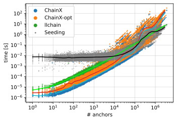

# llchain — log-linear chaining with L∞ gap costs and Δdiag overlap costs
`llchain` is a C++20 program to compute the anchored edit distance between query and reference sequences via colinear chaining in O(n log n) time, built on the same tech stack as [`at-cg/ChainX`](https://github.com/at-cg/ChainX). It supports FASTA or gzipped FASTA input, it computes maximal unique/exact anchors, and it supports the output of an optimal chain in MUMmer-like or SAM format.

Right now, the program has been tested GCC version 15. Get the repository and compile `llchain` with
```console
git clone https://github.com/nrizzo/llchain && cd llchain
git submodule update --init ext/mummer
make -j $(nproc)
./llchain --text test/T1.fasta --query test/T2.fasta
```

## Experiments
To run the experiment on HG002 PacBio HiFi reads aligned to the T2T-CHM13 reference, check [`experiments/ChainX-human/README.md`](experiments/ChainX-human/README.md). The results, where we compare the chaining cost of `llchain` to [`ChainX`](https://github.com/at-cg/ChainX) and [`ChainX-opt`](https://github.com/algbio/ChainX) on maximal exact match anchors of length >= 50, are shown in the next figure.



## External libraries
`llchain` is built with the following libraries:

- [kseq](https://github.com/lh3/seqtk) for FASTA parsing
- [mummer (essaMEM)](https://github.com/mummer4/mummer.git) for seed finding
- [algbio/ChainX](https://github.com/algbio/ChainX) for the `--chainx` and `--chainx-opt` flags
- [grid_to_bmp](https://people.sc.fsu.edu/~jburkardt/cpp_src/grid_to_bmp/grid_to_bmp.html) for debugging

## Dependencies
`gengetopt` for development

## Citation
If you use flags `--chainx` or `--chainx-opt`, please cite the corresponding works:
- **Chirag Jain, Daniel Gibney and Sharma Thankachan**. "[Algorithms for Colinear Chaining with Overlaps and Gap Costs](https://doi.org/10.1089/cmb.2022.0266)". *Journal of Computational Biology*, 2022.
- **Nicola Rizzo, Manuel Cáceres, and Veli Mäkinen**. "[Practical colinear chaining on sequences revisited](https://doi.org/10.1007/978-981-95-0695-8_17)" ([arXiv](https://doi.org/10.48550/arXiv.2506.11750)). *ISBRA 2025*.

## TODOs
- see if the ChainX-opt "bug fix" about strict ChainX precedence affects performance
- use [CLI11](https://github.com/CLIUtils/CLI11) instead of gengetopt
- avoid using a list in case 2
